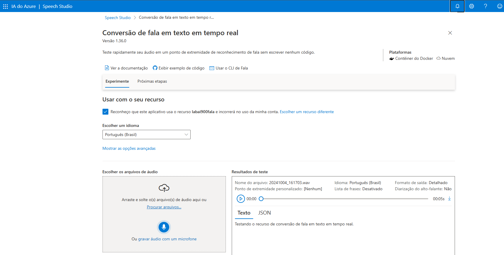
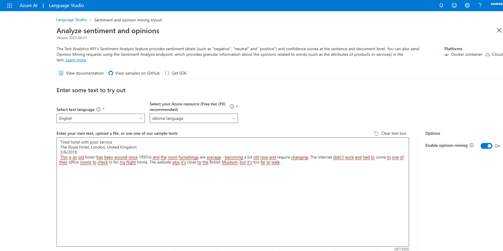
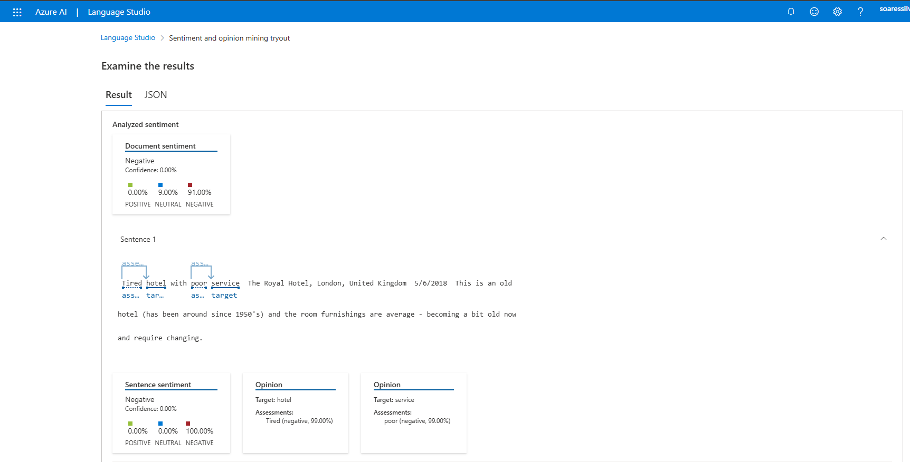
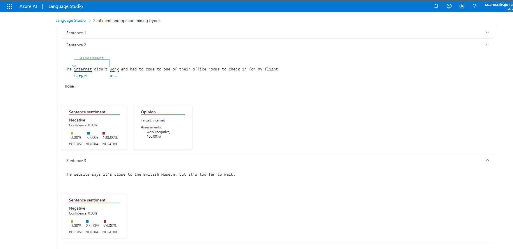
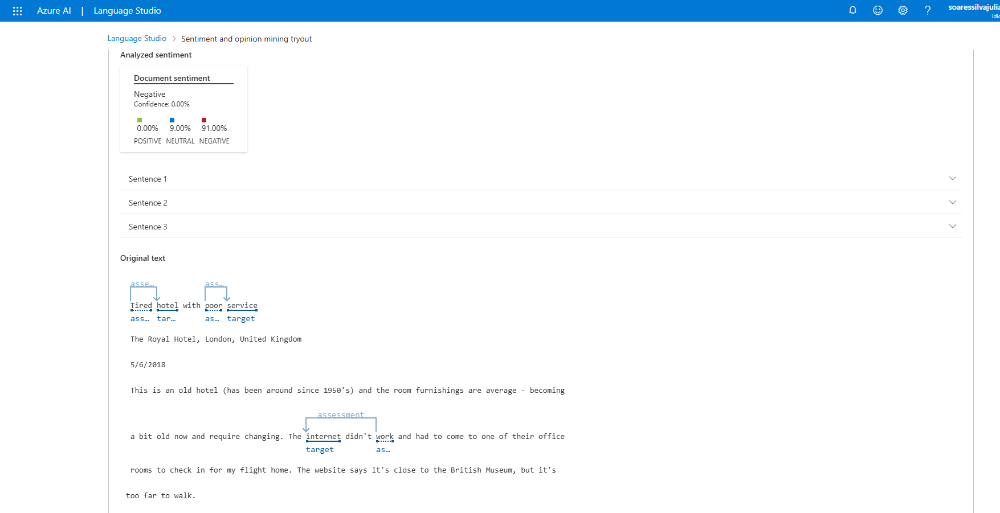

<h1>Análise de Sentimentos com Language Studio no Azure AI</h1>

<h3>Repositório criado para o desafio do bootcamp Microsoft - Fundamentos de IA</h3>

<h4 align="justify">Descrição do projeto</h4>

    Este projeto demonstra a utilização de ferramentas do Azure AI para análise de sentimentos em texto e conversão de fala para texto em tempo real. Durante as práticas, explorei as capacidades do Azure AI Language Studio e Speech Service para transformar dados não estruturados em insights valiosos.

 

<h2>🛠 Ferramentas Utilizadas</h2>

    <ul>
        <li><a href="https://language.cognitive.azure.com/"><b>Azure AI Language Studio:</b></a> Utilizado para realizar a análise de sentimentos e opiniões em textos.
        <li><a href="https://speech.microsoft.com/portal/"><b>Conversão de Fala para Texto:</b></a> Plataforma para transcrever fala em tempo real para texto.
    </ul>

<h2>🚀 Objetivos e Passo a Passo</h2>

<h3>Prática 01 - Conversão de Fala para Texto</h3>

<ol>
    <li>Acesse o portal do Speech Service.
    <li>Ative o microfone e inicie uma conversão em tempo real.
    <li>Resultado: Obtenção de uma transcrição precisa da fala.
</ol>

<h3>Prática 02 - Análise de Sentimentos e Opiniões</h3>

<ol>
    <li>Acesse o portal do Language Studio.
    <li>Submeta um texto de exemplo ou frases criadas na pasta inputs.
    <li>Analise os resultados gerados, como:
    <ul>
        <li>Polaridade (Positiva, Neutra ou Negativa)
        <li>Opiniões associadas a entidades mencionadas
    <ul>
</ol>

<h2>📊 Insights Obtidos</h2>

<ul>
    <li>A análise de sentimentos pode ser aplicada para:
        <ul>
            <li>Avaliação de feedbacks de clientes.
            <li>Monitoramento de menções em redes sociais.
        </ul>
    <li>O serviço de conversão de fala para texto tem uso prático em:
        <ul>
            <li>Assistentes de voz.
            <li>Automação de transcrição para entrevistas ou reuniões.
        </ul>
</ul>

<h2>📸 Exemplos de Resultados</h2>

<h3>Conversão de Fala para Texto</h3>

<h3>Análise de Sentimentos</h3>

